[//]: # (Παρακάτω δίνονται οι οδηγίες για την εγκατάσταση του λειτουργικού συστήματος **Debian** σε εικονική μηχανή μέσω του λογισμικού **Virtual Box**.)

**Σημείωση**: Επειδή το σύστημα του καθενός είναι διαφορετικό, ενδεχομένως να συναντήσετε προβλήματα κατά την εκκίνηση της εικονικής μηχανής.
Σε κάθε περίπτωση, μπορείτε να αναζητήσετε λύση για κάθε σφάλμα με βάση τα μυνήματα σφάλματος που συναντάται.

**Προσοχή:** Για να μπορέσει να εκκινηθεί η εικονική μηχανή θα πρέπει να έχετε ενεργοποιήσει την λειτουργία εικονικοποίησης (virtualization)
στις ρυθμίσεις BIOS του μηχανήματός σας.

# Εγκατάσταση της εικονικής μηχανής

Αρχικά εγκαταστήστε το λογισμικό [Virtual Box](https://www.virtualbox.org/) στο σύστημά σας.

Στη συνέχεια κατεβάστε το Debian .iso αρχείο το οποία αντιστοιχεί στην αρχιτεκτονική του επεξεργαστή σας. 
Σε περίπτωση που **δεν** ξέρετε αν έχετε αρχιτεκτονική 64 ή 32 bit, κατεβάστε το 64 bit iso (η πλειοψηφία των συστημάτων πλέον είναι 64bit).

* [Κατεβάστε από εδώ](https://cdimage.debian.org/debian-cd/current/amd64/iso-cd/debian-11.5.0-amd64-netinst.iso) το Debian .iso για αρχιτεκτονική 64 bit.
* [Κατεβάστε από εδώ](https://cdimage.debian.org/debian-cd/current/i386/iso-cd/debian-11.5.0-i386-netinst.iso) το Debian .iso για αρχιτεκτονική 32 bit.
* [Κατεβάστε από εδώ](https://cdimage.debian.org/debian-cd/current/arm64/iso-cd/debian-11.5.0-arm64-netinst.iso) το Debian .iso για αρχιτεκτονική ARM 64 bit (υπολογιστές Mac).

Εναλλακτικά, μπείτε [εδώ](https://www.debian.org/distrib/netinst#smallcd) για να βρείτε το Debian .iso που αντιστοιχεί στην αρχιτεκτονική του συστήματός σας.

Αυτό το .iso αρχείο περιέχει μέσα όλα τα δεδομένα που χρειάζονται για να εγκαταστήσουμε σε έναν υπολογιστή το λειτουργικό σύστημα.
Αν θέλαμε να εγκαταστήσουμε το λειτουργικό σύστημα Debian κατευθείαν στον υπολογιστή μας, θα έπρεπε να γράψουμε τα περιεχόμενά του σε κάποιο μέσο αποθήκευσης (USB stick, CD-ROM...) και να κάναμε εκκίνηση του συστήματός μας μέσα από αυτό το μέσο.
Σε μία εικονική μηχανή αρκεί να φορτώσουμε το .iso αρχείο στην [εικονική είσοδό](https://en.wikipedia.org/wiki/Parallel_ATA) της για δίσκους.

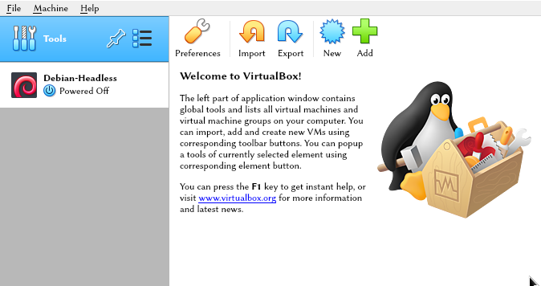{height=30%}

Έπειτα, ανοίξτε το Virtual Box και πατήστε στο κουμπί "New".

**Ακολουθήστε τα βήματα εγκατάστασης με βάση τις παρακάτω εικόνες.**

{height=25%}

{height=25%}

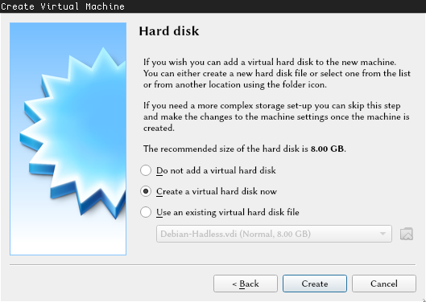{height=25%}

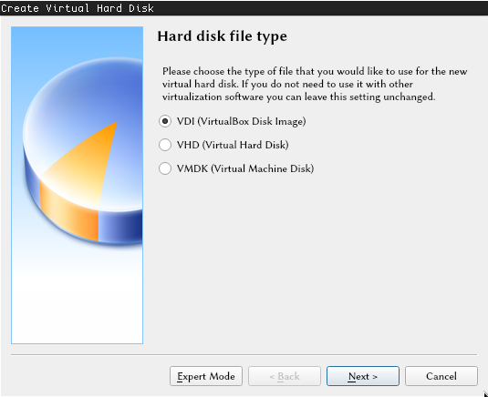{height=25%}

{height=25%}

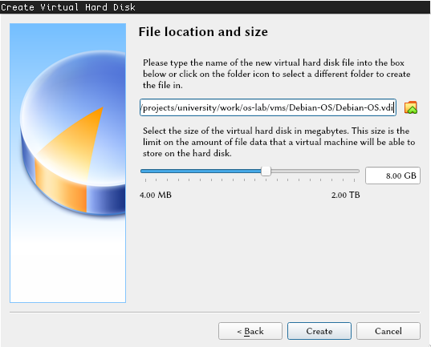{height=25%}

Κρατάμε τις βασικές ρυθμίσεις εφόσων το εικονικό σύστημα που θα στήσουμε δεν θα χρειαστεί να έχει στη διάθεσή του πολλούς πόρους.

Επιλέξτε την εικονική σας μηχανή από τη λίστα και εκκινήστε τη.

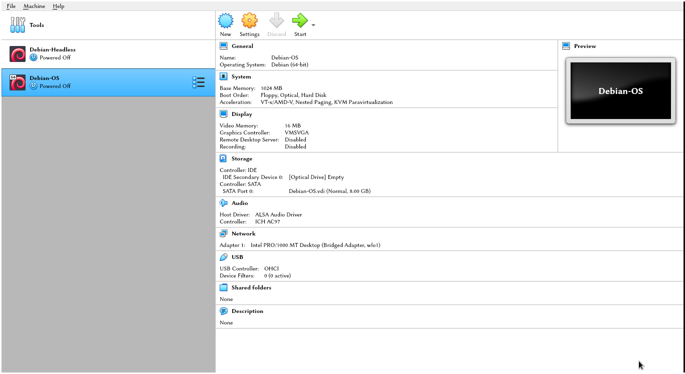{height=35%}

Στο prompt που θα εμφανιστεί θα σας ζητηθεί να επιλέξετε κάποιο δίσκο από τον οποίο θα προσπαθήσει να εκκινηθεί το σύστημα. Εδώ θα επιλέξετε το αρχείο .iso που κατεβάσατε προηγουμένως.

Εναλλακτικά, μπορείτε να πάτε στην εικονική σας μηχανή, στις ρυθμίσεις της και στο μένου "Storage" να επιλέξετε τον δίσκο "Controller: IDE" και να προσθέσετε το αρχείο .iso ως είσοδο.

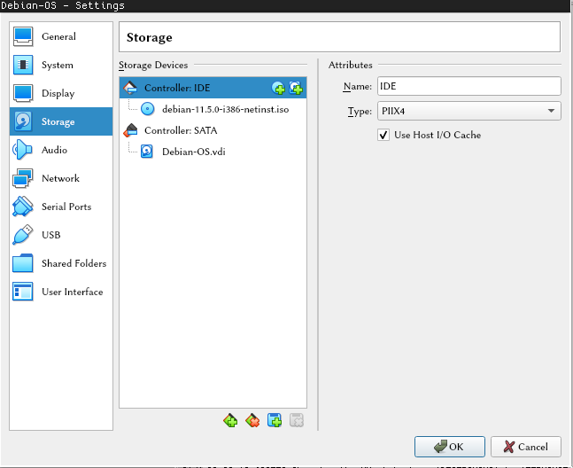{height=35%}

Όταν ξεκινήσει πλέον η εικονική μηχανή θα δείτε την εξής οθόνη:

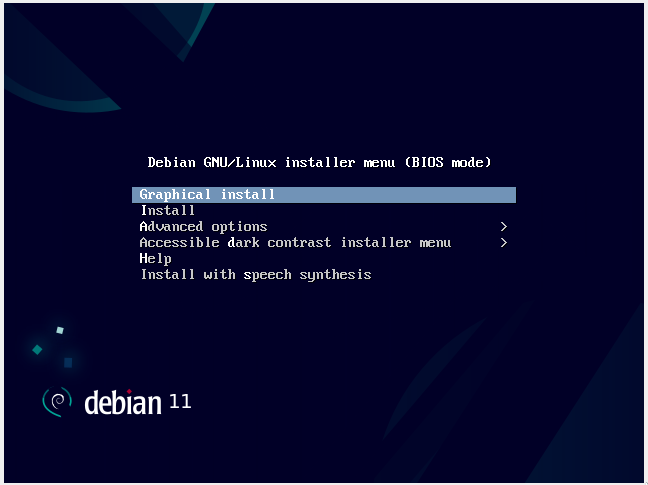{height=35%}

Επιλέξτε "Graphical install" αν θέλετε να έχετε γραφικό περιβάλλον κατά τη διαδικασία εγκατάστασης (προτεινόμενο).
Στην εγκατάσταση θα γίνουν οι εξής ενέργειες: 

* Θα οριστούν βασικές πληροφορίες όπως χρονική ζώνη, τύπος πληκτρολογίου, όνομα χρήστη κ.α
* Θα δημιουργηθούν οι απαραίτητες κατατμήσεις δίσκου ([disk partitions](https://en.wikipedia.org/wiki/Disk_partitioning)) οι οποίες θα ορίσουν ποιες και πώς θα αντιστοιχηθούν περιοχές μνήμης του δίσκου στο σύστημα.
* Θα εγκατασταθούν βασικές εφαρμογές και (προαιρετικά) ένας διαχειριστής παραθύρων ([window manager](https://en.wikipedia.org/wiki/Window_manager)).

**Προσοχή: Θα πρέπει να έχετε πρόσβαση στο διαδίκτυο κατά τη διάρκεια της εγκατάστασης ώστε να κατέβουν στο σύστημά σας όλα τα απαραίτητα πακέτα.**

Στις επιλογές που θα προκύψουν εισάγετε τα ακόλουθα: 

1. Language - English
2. Country, territory or area: (Επιλέξτε τη χώρα που βρίσκεστε αυτή τη στιγμή - η επιλογή αυτή ορίζει πράγματα όπως την ώρα του συστήματός σας)
3. Country to base default local settings on: en_US.UTF-8 (Αυτή η ρύθμιση ορίζει πράγματα όπως τη γλώσσα του συστήματος)
4. Keymap to use: American English (Τα περισσότερα ελληνικά πληκτρολόγια ακολουθούν αμερικάνικη διάταξη για τα σύμβολά τους.)
5. Hostname: debian (Αυτό θα είναι το όνομα με το οποίο άλλες συσκευές στο δίκτο θα αναγνωρίζουν την εικονική σας μηχανή. Μπορεί να είναι ό'τι σας αρέσει.)
6. Domain name: __κενό__
7. Root password: __κωδικός__ (Αυτός θα είναι ο κωδικός για τον χρήστη διαχειριστή της μηχανής σας. Φροντίστε να τον θυμάστε γιατί θα τον χρειαστούμε στη συνέχεια.)
8. Full name for the new user: __Όνομα__ __Επώνυμο__
9. Username for your account: __όνομα__ (Αυτό θα είναι το όνομα χρήστη σας.)
10. Choose a password for the new user: __κωδικός__ (Αυτός θα είναι ο κωδικός με τον οποίο θα συνδέεστε στον λογαριασμό χρήστη σας. Φρόντιστε να τον θυμάστε.) 
11. Partition method: Guided - use entire disk 
12. Select disk to partition: Επιλέξτε τον πρώτο δίσκο στη λίστα. Αυτός θα είναι ο εικονικός δίσκος που δημηιουργήσαμε όταν στήναμε αρχικά την εικονική μηχανή. Θα έχει μέγεθος 8.6Gb.
13. Partition scheme: All files in one partition (Εδώ ορίζουμε πως όλοι οι φάκελοι στον υπολογιστή μας θα βρίσκονται στην ίδια κατάτμηση δίσκου.)
14. Αφού βεβαιωθείτε ότι όλα είναι σωστά, πατήστε στο: "Finish partitiong and write changes to disk". Μετά επιλέξτε την επιλογή "Yes".

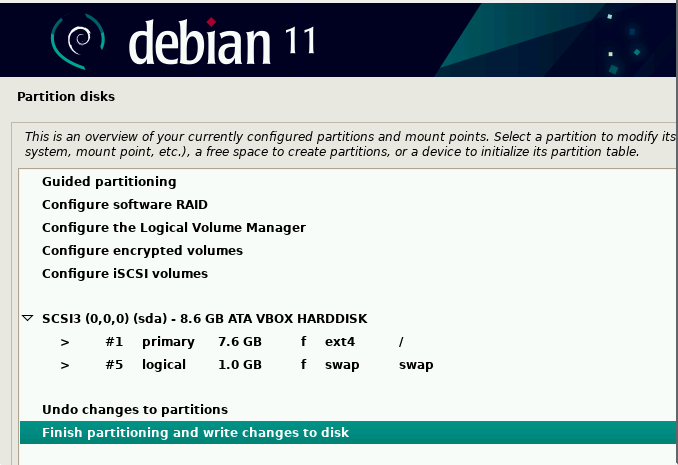{height=25%}

15. Περιμένετε...
16. Scan extra insallation media?: No

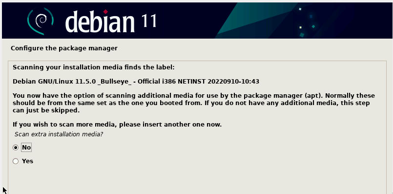{height=25%}

17. Debian archive mirror country: Greece (Εδώ επιλέξτε τη χώρα που βρίσκεται πιο κοντά σε αυτή που είστε γεωγραφικά)
18. Debian archive mirror: deb.debian.org
19. HTTP proxy information: __κενό__
20. Περιμένετε...
21. Participate in the package usage survery?: No ή Yes
22. Choose software to install: Debian desktop environment, GNOME και standard system utilities (Αυτή η επιλογή δεν έχει σημασία. Αν δεν ξέρετε ποιο γραφικό περιβάλλον να επιλέξετε, διαλέξτε το GNOME.) Φυσικά, αν είστε άνετοι με τη χρήση του τερματικού, μπορείτε να έχετε ένα σύστημα χωρίς γραφικό περιβάλλον.

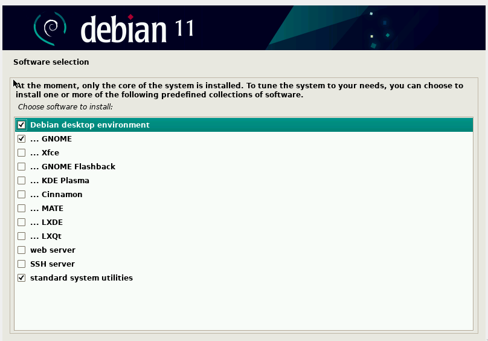{height=25%}

23. Περιμένετε...

Πλέον μπορείτε να επανεκκινήσετε το σύστημα. Μόλις το ανοίξετε ξανά θα μπορείτε να κάνετε login στο χρήστη που δημιουργήσατε.

# Προετοιμασία περιβάλλοντος ανάπτυξης
 
Τώρα έχουμε ένα σύστημα το οποίο τρέχει το λειτουργικό σύστημα Linux. 
Η διανομή μας είναι η Debian.

Αν επιλέξατε το γραφικό περιβάλλον Gnome θα δείτε την εξής οθόνη.

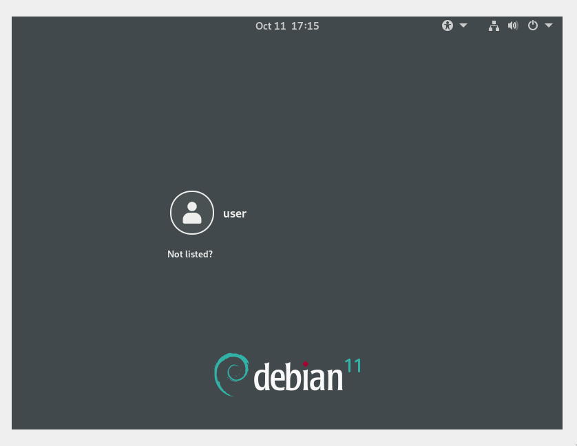{height=35%}

Κάντε login με τον κωδικό και το όνομα χρήστη που ορίσατε προηγουμέμνως.
Ανοίξτε ένα terminal.
(Κουμπί "Activities" > Search Bar > "Terminal")

Το πρόγραμμα το οποίο ανοίγει είναι ένας προσωμοιωτής τερματικού ([terminal emulator](https://en.wikipedia.org/wiki/Terminal_emulator)). 
Εδώ μπορούμε να εκτελούμε διάφορες εντολές.
Αποτελεί ένα πιο άμεσο μέσο επικοινωνίας με τον υπολογιστή μας σε αντίθεση με τις γραφικές διεπαφές που απευθύνονται σε απλούς χρήστες.

Ο τρόπος που πολλές διανομές Linux χειρίζονται την εγκατάσταση/απεγκατάσταση πακέτων είναι μέσω διαχειριστών πακέτων (package managers).
Αυτά είναι εφαρμογές που δίνοντάς τους το όνομα μίας εφαρμογής, μπορούν να την αναζητήσουν σε κάποιο αποθετήριο, να την κατεβάσουν στο σύστημά μας και να την εγκαταστήσουν. 
Αυτή η μέθοδος εγκατάστασης πακέτων είναι παρόμοια με τον τρόπο που πολλά κινητά επιτρέπουν στους χρήστες να κατεβάζουν εφαρμογές μέσω κάποιου κεντρικού αποθετηρίου (app store). 

Το πρόγραμμα apt είναι αυτό που στα Debian εκτελεί αυτές τις λειτουργίες.
Για την ανάπτυξη του κώδικα θα χρειαστεί να βρίσκονται στο σύστημά μας κάποιες εφαρφμογές.

Για να δουλέψετε με το xv6 Kernel εκτελέστε τις παρακάτω εντολές (δεν χρειάζεται να γράψετε το "$").
Αυτές θα κατεβάσουν για αρχή μερικά απαραίτητα πακέτα όπως ένα compiler toolchain, το πρόγραμμα git για διαχείρηση εκδόσεων κώδικα και 
τον qemu emulator μέσα στον οποίο θα φορτώσουμε και θα τρέξουμε το λειτουργικό σύστημα xv6.

```bash
$ sudo apt install build-essential git qemu 
```
**Μπορείτε να συνέχισετε στην εκφώνηση της πρώτης δραστηριότητας!**
